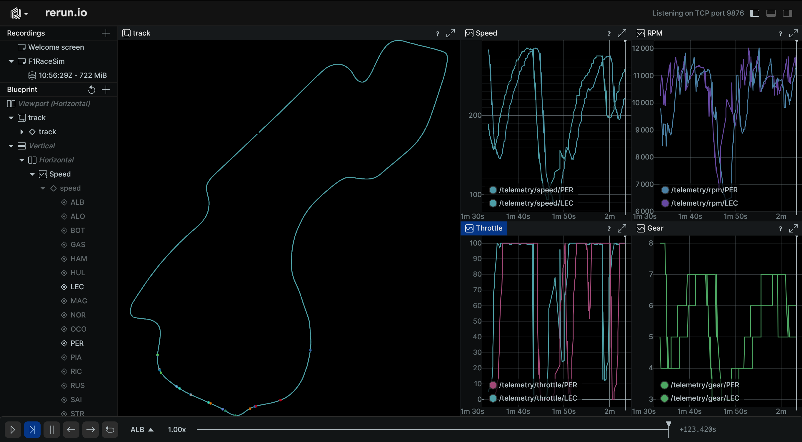

# Bytewax-rerun F1 race replayer

Hackday project using [bytewax](https://bytewax.io), [rerun](https://rerun.io) and [fastf1](https://docs.fastf1.dev).

Replay any session fastf1 offers with live track visualization and telemetry data.

## Usage

Install dependencies:

```shell
python -m venv .venv
source .venv/bin/activate # or activate.fish
pip install bytewax==0.20.1 fastf1==3.3.7 rerun-sdk==0.16.1
```

Replay a session, for example the race of the third week of 2024:
```
python -m bytewax.run 'main:replay_session(year=2024, week=3, session="R")'
```

See fastf1 docs for session options, rerun docs to show different metrics, bytewax docs to change the dataflow.



